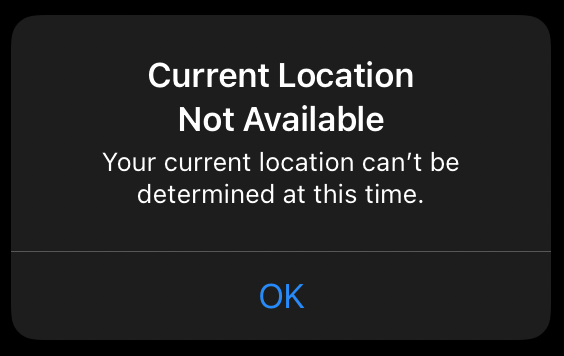
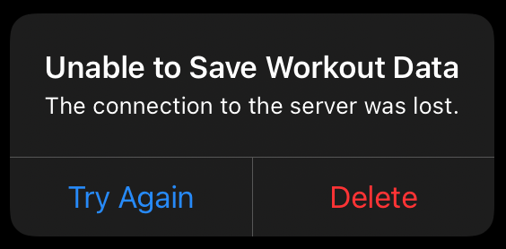

# SwiftUI-Alert

当你想让用户对应用程序或系统的状态做出反应时，使用警告。如果你想让用户做出一个选择来响应他们自己的动作，使用ActionSheet代替。

您可以使用alert(ispresentated:content:)视图修饰符来创建一个警告，当绑定的ispresentated值为true时，该警告就会出现。提供给此修饰符的内容闭包生成Alert类型的自定义实例。

``` swift

@State private var showAlert = false
var body: some View {
    Button("Tap to show alert") {
        showAlert = true
    }
    .alert(isPresented: $showAlert) {
        Alert(
            title: Text("Current Location Not Available"),
            message: Text("Your current location can’t be " +
                            "determined at this time.")
        )
    }
}

```



要自定义警报，请添加警报的实例。按钮类型，它为取消和执行破坏性操作等常见任务提供了标准化按钮。下面的示例使用了两个按钮:一个标记为“Try Again”的默认按钮，它调用saveWorkoutData方法;一个“destructive”按钮，它调用deleteWorkoutData方法。

``` swift

@State private var showAlert = false
var body: some View {
    Button("Tap to show alert") {
        showAlert = true
    }
    .alert(isPresented: $showAlert) {
        Alert(
            title: Text("Unable to Save Workout Data"),
            message: Text("The connection to the server was lost."),
            primaryButton: .default(
                Text("Try Again"),
                action: saveWorkoutData
            ),
            secondaryButton: .destructive(
                Text("Delete"),
                action: deleteWorkoutData
            )
        )
    }
}

```




当用户点击警报中的一个按钮时，警报处理它自己的解除，方法是将绑定的ispresentation值设回false。