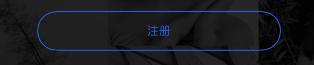

# SwiftUI-设置圆角

## 使用cornerRadius和Border设置圆角

``` swift

Button("注册"){}
  .frame(width: 250, height: 40)
  .font(.caption)
  .foregroundColor(hexColor(hex: 0x1D5EF3))
  //	设置边框
  .border(hexColor(hex: 0x1D5EF3), width: 1)
  //	设置圆角大小
  .cornerRadius(20)

```

效果图如下:


SwiftUI默认为maskToBounds，所以这种方式设置的圆角会被裁剪一部分。


## 使用overlay设置圆角


``` swift

Button("注册"){}
  .frame(width: 250, height: 40)
  .font(.caption)
  .foregroundColor(hexColor(hex: 0x1D5EF3))
  //	通过overlay设置圆角的大小及边框颜色
  .overlay(RoundedRectangle(cornerRadius: 20, style: .continuous)
    .stroke(hexColor(hex: 0x1D5EF3), lineWidth: 1)
    )
  .padding(.top, 8)

```

效果图如下:



用Overlay设置圆角，不会被裁剪。