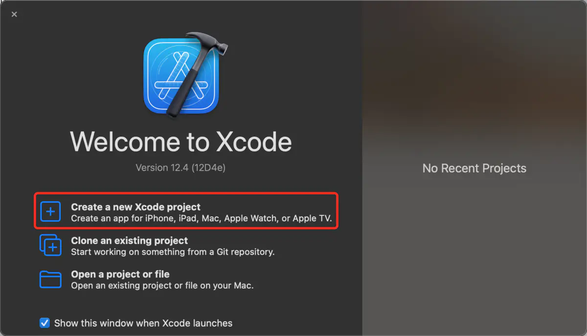
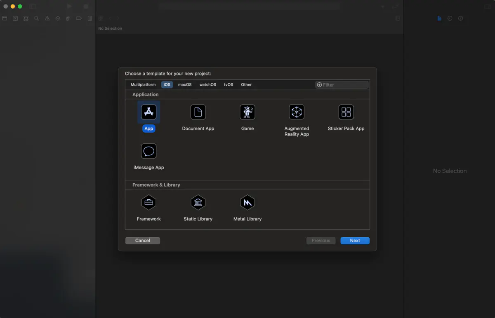
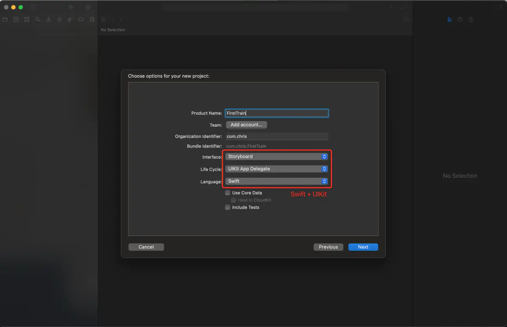
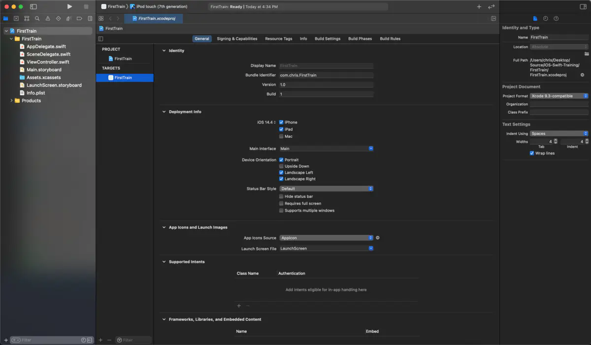
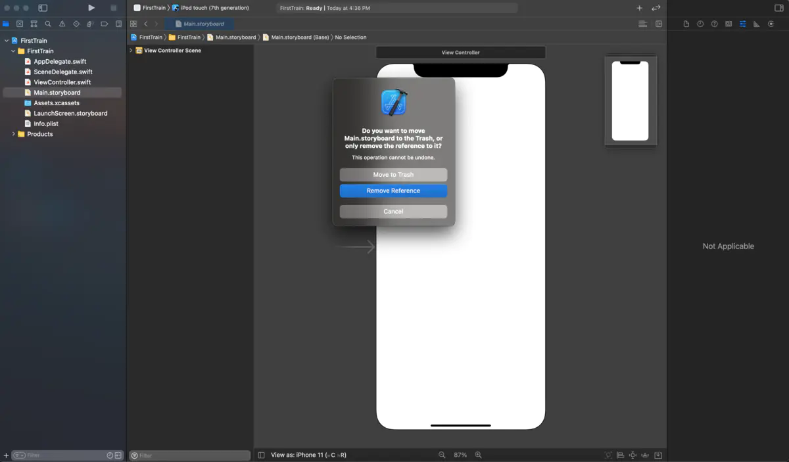
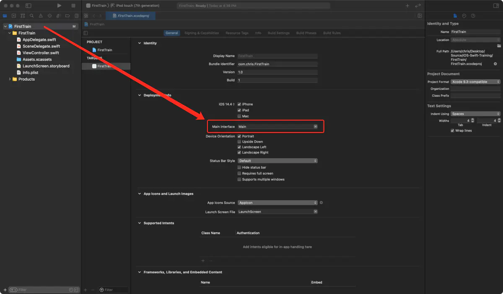
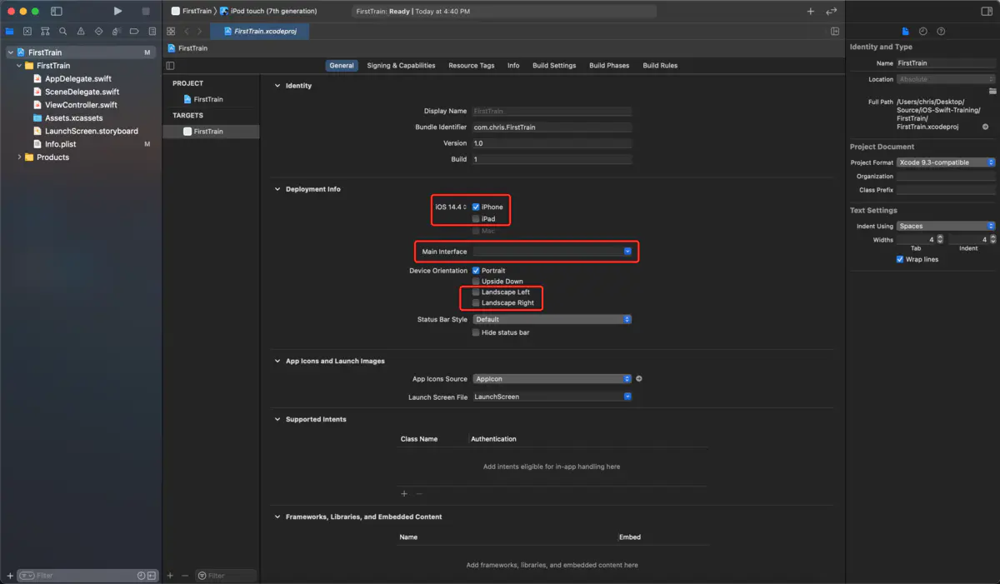
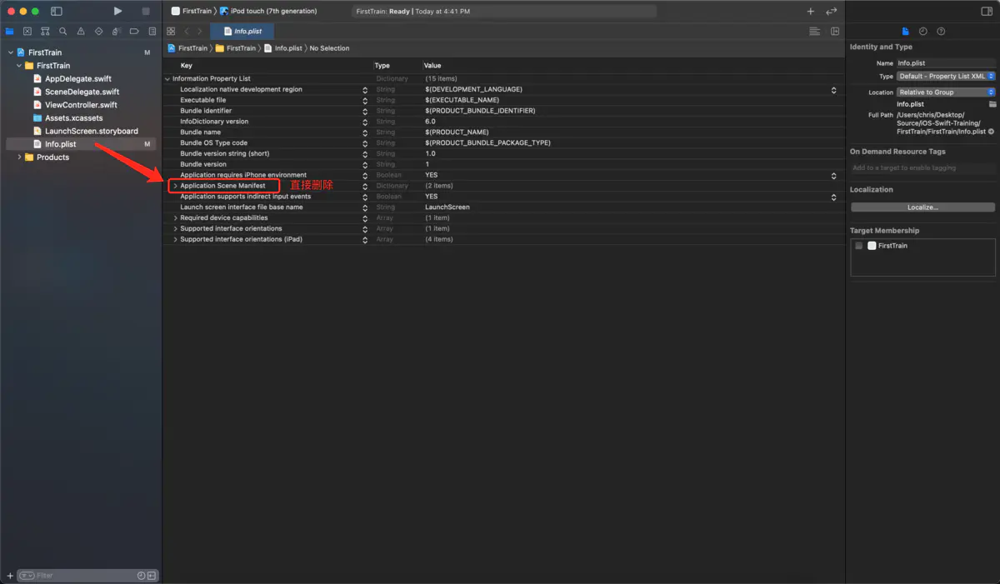
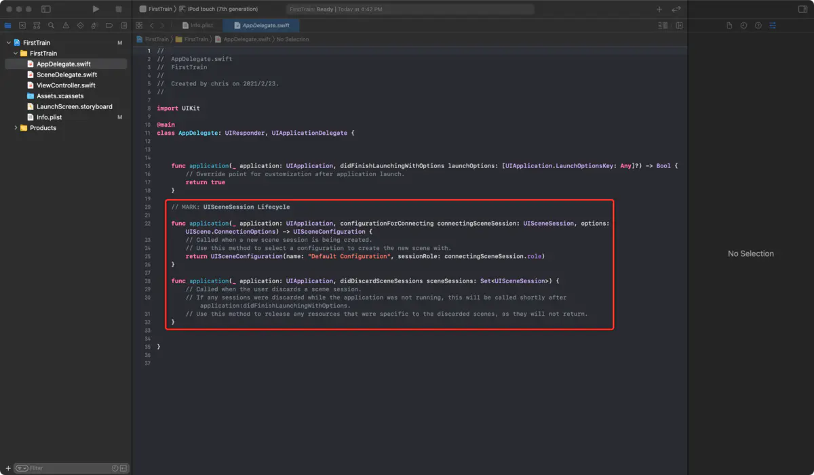
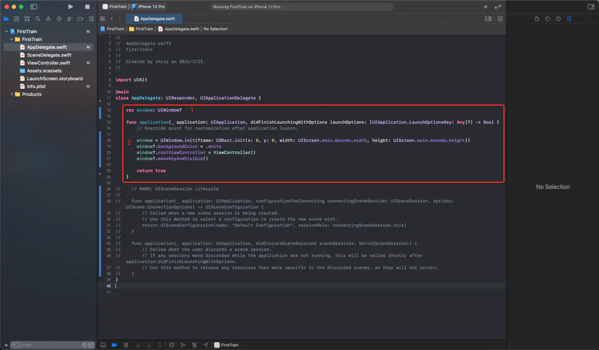

# swift5从0到1创建项目删除main.storyboard

## 创建项目

1. 打开 Xcode，选择『Create a new Xcode project』

2. 选择『iOS - App』

3. 选择『Swift + UIKit』，别选择『SwiftUI』了

4. 创建成功如下图

## 删除main.storyboard

1. 删除main.storyboard -> 选择『Move to Trash』

2. 修改『xcodeproject配置』-> 选择『FirstTrain』

3. 删除『Main』，并勾选掉『iPad』、『Landscape Left』、『Landscape Right』

4. 修改『Info.plist』

5. 修改『AppDelegate.swift』

## 创建UIWindow

1. 修改『AppDelegate.swift』,创建 UIWindow

