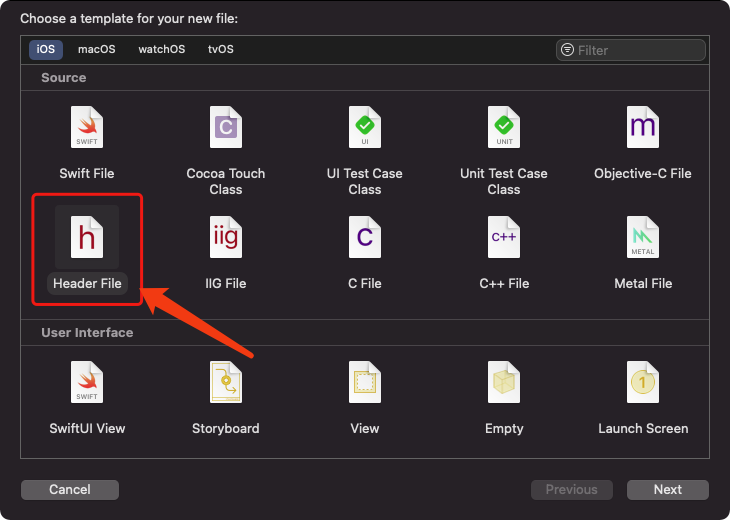

# OC和swift混编

## 创建桥接文件

打开Xcode，创建Header-File



这个文件基本是个全局文件，设置地址。

## 设置桥接文件


## 在桥接文件中引入OC的.h文件

``` swift

#ifndef LittlePink_Bridging_Header_h
#define LittlePink_Bridging_Header_h

#endif /* LittlePink_Bridging_Header_h */

#import "MBProgressHUD.h"

```

## 在使用的文件中使用

``` swift

import MBProgressHUD

```