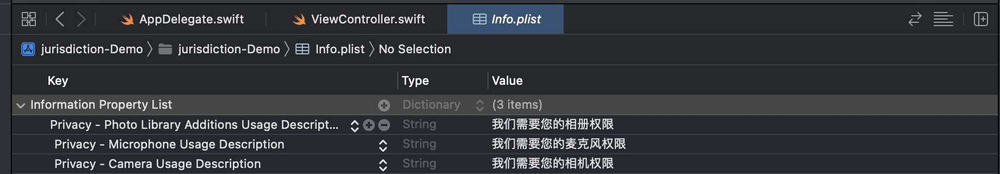

# iOS-请求麦克风、相册权限、相机权限

## 方式一

在info.plist里面添加以下内容



## 方式二

### 麦克风权限

``` swift

override func viewDidLoad() {
        super.viewDidLoad()
        // Do any additional setup after loading the view.
        
        checkAudioStatus()
        AVCaptureDevice.requestAccess(for: .audio) { granted in
            granted ? print("麦克风允许") : print("麦克风不允许")
        }
        
    }

func checkAudioStatus() {
  var authStatus = AVCaptureDevice.authorizationStatus(for: .audio)
  switch authStatus {
  	case .notDetermined:
  authStatus = .notDetermined
  	case .restricted:
  authStatus = .restricted
  	case .denied:
  authStatus = .denied
  	case .authorized:
  authStatus = .authorized
  default:
  	break
  }
}

```

### 相册权限

``` swift

/// 获取相册权限
func requestPhotoAuth(_ complete: @escaping ((_ status: PhotoAuthStatus) -> Void)) {
	if #available(iOS 14.0, *) {
		PHPhotoLibrary.requestAuthorization(for: .readWrite) { (status) in
			if status == .authorized {
      	complete(.authorized)
      } else if status == .limited {
      	complete(.limited)
      } else {
      	complete(.denied)
      }
		}
	} else {
  PHPhotoLibrary.requestAuthorization { (status) -> Void in
      if status == .authorized {
        complete(.authorized)
      } else {
        complete(.denied)
      }
  	}
	}
}

```