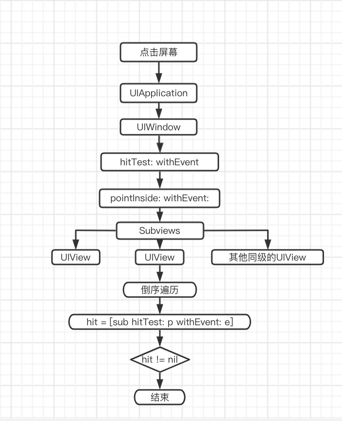
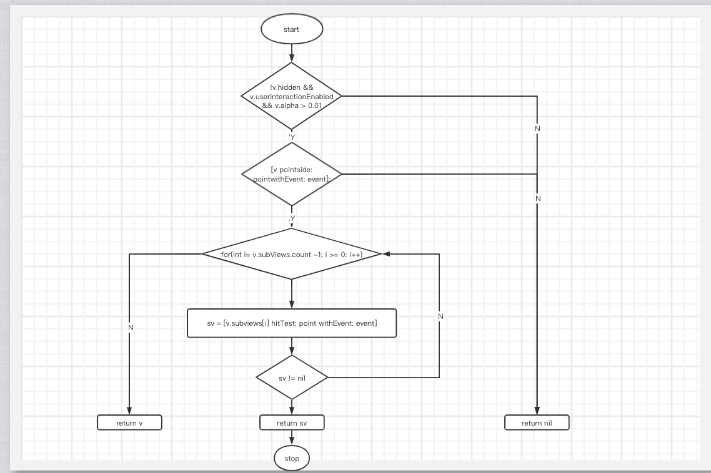

# iOS的UI事件传递&响应

## 事件传递流程

点击屏幕 -> UIApplication -> UIWindow -> hitTest: withEvent: -> pointInside: withEvent: -> Subviews -> (UIView和其他同级的UIView) 

1.点击屏幕时首先将事件传递给UIApplication，UIApplication将事件传递给UIWindow。
2.UIWindow调用hitTest返回响应视图，先通过pointInside:判断是否在UIWindow范围内，如果在的话会通过倒序的方式遍历UIWIndow的子视图找出响应视图，最后添加的子视图会最先调用hitTest方法，递归调用hitTest返回找到的视图。

## hitTest: withEvent内部实现流程图

