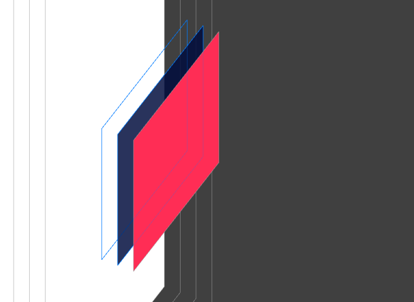

# iOS解决点击穿透问题

## 问题描述



现有一个大小与位置均相同的两个UIView，我现在要点击黑色的UIView响应点击的手势，但是由于红色的UIView的遮挡无法响应，所以需要进行一个穿透操作来使其响应。

## 解决方案

### 方案一

将红色View的穿透设置为关闭，将黑色View的穿透设置为打开。

``` swift
// coverView:为黑色UIView, hitView: 为红色UIView
coverView.isUserInteractionEnabled = true

hitView.isUserInteractionEnabled = false

```

### 方案二

重写系统方法

``` swift

override func hitTest(_ point: CGPoint, with event: UIEvent?) -> UIView? {
    let coverPoint = self.convert(point, to: coverView)
    if coverView.point(inside: coverPoint, with: event) {
        return coverView
    }
    return super.hitTest(point, with: event)
}

```

## 补充

我这里是因为写的测试View，我实际使用是在UICollectionView的Cell上面设置穿透，但是重写系统方法的时候，会使得UICollectionView的didSelect方法失效，所以建议在这种情况下使用第一种方案。